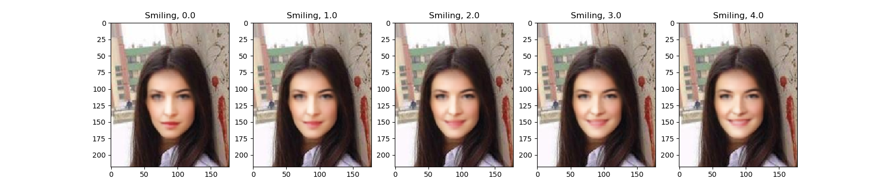
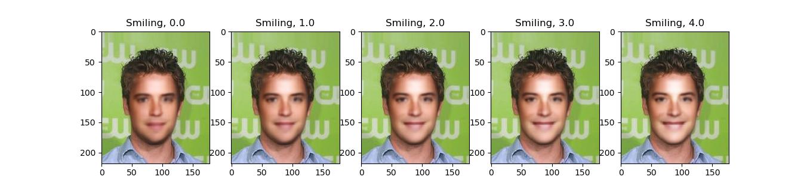
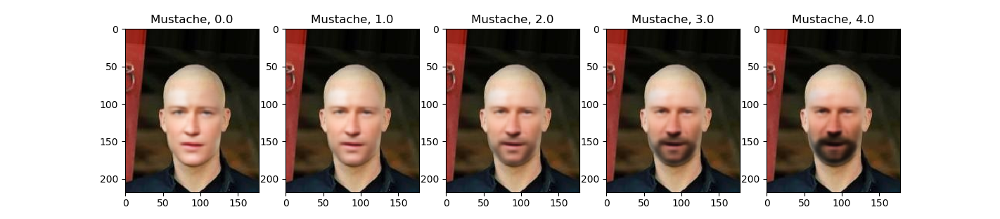
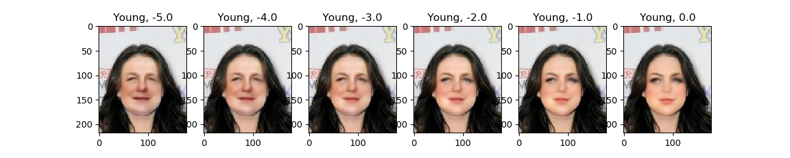
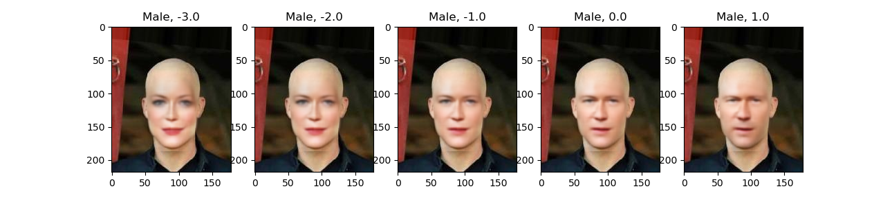

# Face Flex

This is an implementation of a Variational Autoencoder (VAE) for human faces. You can use it to alter the facial expressions in images. It can automatically detect faces in an image, extract them, modify them, and then place them back into the image. An example of a face where we added smiling with this is:


Currently the VAE can only handle 128x128 input images, so the altered face will never have a higher resolution than that. Therefore the model works best when the size of the faces in the input images is a little smaller than 128x128, we recommend 100x100.

## How to use

This project requires Python 3.6 or higher. The neural network is based on PyTorch. For Face-Detection and Landmark-Detection, we use dlib. Please install all the dependencies from the `requirents.txt` file with

```
python3 -m pip install -r requirements.txt
```

Now you need to load the weights for the trained VAE into a new folder named `data`. They can be found [here](https://drive.google.com/file/d/1go_uplPQc0AcelbEwWz-3MO0rFxSgMsG/view?usp=sharing). Also, you need to put the trained landmark detector there, so download [this](https://drive.google.com/file/d/1pB3qjS1rrq8p_VkyPI6Goaa2e70E6XAW/view?usp=sharing) file and put it there as well.

Now you can run the project on your own images. To specify what you want to do edit the `config.py` file. Example:

```python
config = {
    'attribute': 'Smiling',
    'parameter_range': (0, 5.1, 1), # (min, max, step)
    'image_filename': './myimage.jpg',
    'sample_size': 5
}
```
- specify the image to modify under `image_filename`
- specify the attribute to change with `attribute`. Currently available are: `Smiling`, `Mustache`, `Young` and `Male`
- specify a range of parameters to use under `parameter_range`. Each parameter from this range is used to create one image and the value specifies how strong the attribute should be applied. A parameter valued  `p` will lead to the addition of `p` times the attribute vector to the base latent vector. The value of `parameter_range` should be a 3-tuple like `(start, end, step)` which will lead to a range of parameters starting at `start` (imclusive) and stopping at `end` (exclusive) using steps of size `step`.
    - **Note:** Parameter values can also be negative. E.g. if you want to make someone look older, you need to add a negative multiple of the expression vector `Young`, otherwise this would make the person look younger.
- `sample_size` specifies how many different versions of the attribute vector should be used. This is there because there are multiple versions of each vector, e.g. different versions of the `Smiling` vector lead to different types of smiling and it also depends on the image how well a single version works. If `sample_size` is set to `n`, this means that there will be `n` versions used that are selected randomly.

To modify your picture run

```
python3 enhance.py 
```

This will plot the resulting images using matplotlib. If you want to store the resulting images in a directory of your choice, you can run the script like this:

```
python3 enhance.py --out_dir <your_output_directory>
```

Optionally, you can also plot the detected face and its landmarks by setting the `--plot_landmarks` option.

## How it works

The input image will be scanned for faces with a dlib face detector, and the found face will be analyzed with a shape predictor (also from dlib) that aligns 68 facial landmarks onto the face. This leads to a picture like this:

<p align="center">
    
</p>

Afterwards the image will be aligned, i.e. we rotate it so that the eyes will form a horizontal line and we will scale it to a uniform size of 128x128 pixels around the face:

<p align="center">
    
</p>

This aligned face can then be fed into the Variational Autoencoder, i.e. it will be encoded as a 500 elements vector that represents the face. This vector can be decoded again to obtain an approximate version of the face again.

To alter the facial expression we have a set of precomputed expression vectors that correspond to certain facial attributes such as smiling, age or gender. The facial expression can be altered by adding or subtracting the suitable expression vector to the face vector encoded by the VAE. If you e.g. want to make someone smile, you can add a multiple of the smiling vector, if you want to remove a smile, you will subtract a multiple of the smiling vector.

Now, we have a modified latent vector that can be decoded by the VAE again to obtain an actual image of the modified face:


This modified image is now scaled back to the original size and moved to its original location in the original image. We use the previously computed locations of the 68 facial landmarks to create a mask around the actual face:
<p align="center">
    
</p>
 We then keep only the pixels that are part of our face and morph them into the original image. This yields the final result:


## Examples 

Here are some example pictures from the CelebA Dataset, the internet and me that have been modified with this VAE.

### Adding Smile





It also works fine with non-portrait images such as this one from Elon Musk:


### Adding Mustache




### Making people look older




### Making people look male/female



